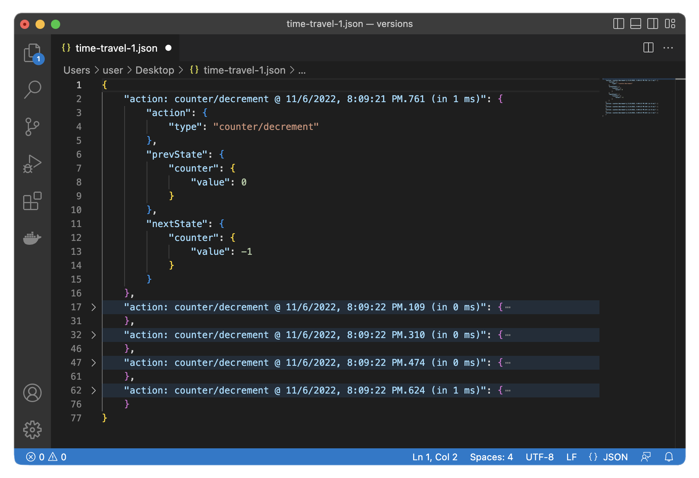

# File Logger for Redux

This tool allows you to log Redux actions + state to files. It also provides a convenient API for file logging, so that you can add your own loggers (e.g. navigation state).



## Motivation

3rd party libraries like [react-native-fs](https://github.com/itinance/react-native-fs) allows you to write data to files, but each write operation opens & closes a new IO stream.

The idea of this library is to use the standard output functions and redirect the output stream to a file, so that the stream remains open. In this case the logging process doesn't affect the app performance

## Installation

```sh
npm install react-native-redux-file-logger
npx pod-install
```

## Usage

### Using Redux file logger middleware

1. Create an async creator for the store that calls `createReduxFileLoggerMiddleware()`

```ts
import { configureStore } from '@reduxjs/toolkit';
import counterReducer from './features/counter/slice';
import type { Middleware } from 'redux';
import { Platform } from 'react-native';

async function createStore() {
  const middlewares: Middleware[] = [];

  if (process.env.NODE_ENV === `development`) {
    const {
      createReduxFileLoggerMiddleware,
      SupportedIosRootDirsEnum,
      SupportedAndroidRootDirsEnum,
    } = require('react-native-redux-file-logger');

    try {
      const rootDir = Platform.OS === 'android' ? SupportedAndroidRootDirsEnum.Files : SupportedIosRootDirsEnum.Cache
      const rflMiddleware = await createReduxFileLoggerMiddleware(
        'redux-action',
        {
          rootDir,
          nestedDir: 'logs',
          fileName: 'time-travel.json'
        },
        {
          showDiff: true,
          shouldLogPrevState: false,
          shouldLogNextState: true,
        }
      )

      middlewares.push(rflMiddleware);
    } catch (e) {
      console.error(e);
    }
  }

  return configureStore({
    reducer: { counter: counterReducer },
    middleware: (getDefaultMiddleware) => getDefaultMiddleware().concat(middlewares),
  });
}

export default createStore;

```

2. Extract the `store` with `useAsyncStoreCreator()` and pass it to `Provider`

```tsx
import * as React from 'react';
import { Provider } from 'react-redux';
import createStore from './store';
import { useAsyncStoreCreator } from 'react-native-redux-file-logger';

export default function App() {
  const store = useAsyncStoreCreator(createStore);

  if (!store) return null;

  return (
    <Provider store={store}>
      ...
    </Provider>
  );
}

```

### Using file logger (e.g. for navigation state logging)

1. Create file logger for navigation
```ts
import { Platform } from 'react-native';
import { addFileLogger, getFileLogger, SupportedAndroidRootDirsEnum, SupportedIosRootDirsEnum } from 'react-native-redux-file-logger';

const rootDir = Platform.OS === 'android' ? SupportedAndroidRootDirsEnum.Files : SupportedIosRootDirsEnum.Cache
await addFileLogger('navigation-state', {
  rootDir,
  nestedDir: 'logs',
  fileName: 'navigation.json'
});

export const navigationStateLogger = getFileLogger(tag);
```
2. Configure navigation state listener
```ts
import {createNavigationContainerRef} from '@react-navigation/native';
import {EventArg, EventListenerCallback, EventMapCore} from '@react-navigation/core';

export const navigationRef = createNavigationContainerRef();
export type StateListenerCallbackType = EventListenerCallback<EventMapCore<any>, 'state'>;
export function addNavigationStateListener(listener: StateListenerCallbackType): void {
  navigationRef.addListener('state', listener);
}
```
3. Pass `ref` to `NavigationContainer`
```tsx
import {navigationRef} from 'path/to/file'

return (
  <NavigationContainer ref={navigationRef} >
    ...
  </NavigationContainer>
)
```
4. Use logger inside navigation state listener
```ts
import {addStateListener, StateListenerCallbackType} from 'path/to/file'
import {navigationStateLogger} from 'path/to/file'

const stateListener: StateListenerCallbackType = e => {
  if (this.isInitialized && e.data.state && e.type) {
    navigationStateLogger.log(e.data.state);
  }
};

addNavigationStateListener(stateListener);
```

## Using archive function

Archiving logs from all file logger instances to a specified file. If you need to archive logs for a single instance, pass the `tag` as a second parameter (see API section).

```ts
import { Platform } from 'react-native';
import { archive, SupportedAndroidRootDirsEnum, SupportedIosRootDirsEnum } from 'react-native-redux-file-logger';

await archive({
  rootDir:
    Platform.OS === 'android'
      ? SupportedAndroidRootDirsEnum.Files
      : SupportedIosRootDirsEnum.Cache,
  fileName: 'logs.zip', // supports only zip format
});
```

## API

### Types

**LoggerOptions**

```ts
type LoggerOptions<TState = any, TLogger extends {log: (message: string) => void} = Logger> = {
  actionInclusionPredicate?: InclusionPredicate<TState>;
  diffInclusionPredicate?: InclusionPredicate<TState>;

  shouldLogPrevState?: boolean;
  shouldLogNextState?: boolean;
  showDiff?: boolean;

  stateTransformer?: (state: any) => any;

  logger: TLogger;
};
```

- **actionInclusionPredicate** - actions filtering function, called before middleware logic execution. If returns false, the middleware won't be applied
- **actionInclusionPredicate** - diffs filtering function
- **shouldLogPrevState** - whether to add previous state to the file
- **shouldLogNextState** - whether to add next state to the file
- **showDiff** - whether to add diff(prev to next) state to the file
- **stateTransformer** - accepts prev & next state and applies its logic to is
- **logger** - logger instance, that implements `log(message: string) => void` method

**InclusionPredicate**

```ts
type InclusionPredicate<TState> = (action: AnyAction, getState: () => TState) => boolean;
```

**FileConfig**

```ts
type FileConfig = {
  fileName: string;
  nestedDir?: string;
  rootDir: SupportedIosRootDirsEnum | SupportedAndroidRootDirsEnum | string;
}
```
Example:
- rootDir: `/storage/emulated/0/Android/data/com.reduxfileloggerexample/files/` (i.e. SupportedAndroidRootDirsEnum.Files)
- nestedDir: `logs`
- fileName: `time-travel.json`
- Resulting path: `/storage/emulated/0/Android/data/com.reduxfileloggerexample/files/logs/time-travel.json`


### Constants

**SupportedIosRootDirsEnum**

Dirs that correspond to `FileManager.SearchPathDirectory` in `Foundation`

```ts
enum SupportedIosRootDirsEnum {
  Downloads = 'Downloads',
  Documents = 'Documents',
  AppSupportFiles = 'AppSupportFiles',
  Cache = 'Cache',
}
```
**SupportedAndroidRootDirsEnum**

Dirs taken from `ReactApplicationContext`

```ts
enum SupportedAndroidRootDirsEnum {
  Cache = 'Cache',
  Files = 'Files',
}
```

### Functions

**createReduxFileLoggerMiddleware()**

```ts
async function createReduxFileLoggerMiddleware<
  State = any,
  BasicAction extends Action = AnyAction,
  ExtraThunkArg = undefined
>(
  tag: string,
  fileConfig: FileConfig,
  loggerOptions: Omit<LoggerOptions<State>, 'logger'>
): Promise<ThunkMiddleware<State, BasicAction, ExtraThunkArg>> {}
```
Creates a Redux file logger middleware. Notice, that it doesn't accept `logger`, because it's encapsulated

- **tag** - unique logger identifier
- **fileConfig** - determines the file path (see above)
- **loggerOptions** - logger options (see above)

**createLoggerMiddleware()**

```ts
function createLoggerMiddleware<
  State = any,
  BasicAction extends Action = AnyAction,
  ExtraThunkArg = undefined
>(options: LoggerOptions<State>): ThunkMiddleware<State, BasicAction, ExtraThunkArg> {}
```
Creates a logger middleware. Unlike `createReduxFileLoggerMiddleware()`, it accepts a `logger` instance, so you can provide your own implementation.

- **options** - logger options (see above)

**addFileLogger()**

```
const addFileLogger = async (tag: string, fileConfig: FileConfig) => Promise<void>
```

Creates a unique file logger instance and stores in a map. Use it when you need to add file logger in addition to Redux (e.g. navigation state change, see example above).

- **tag** - unique logger identifier
- **fileConfig** - determines the file path (see above)

**getFileLogger()**

```
interface Logger {
  log: (message: string) => void;
}

const getFileLogger = (tag: string) => Logger | undefined
```
Gets a logger instance from map by `tag`.

- **tag** - unique logger identifier

**archive()**

```
async function archive(fileConfig: FileConfig, tag?: string) => Promise<void>
```

Archive logs from all logger instances (or for a specific instance if `tag` is provided) to a file. Supports only `zip` format.

- **tag** - unique logger identifier
- **fileConfig** - determines the file path (see above)

### Hooks

**useAsyncStoreCreator()**

```ts
type AsyncStoreCreator<
  TState = any,
  TAction extends Action = AnyAction,
  TStore extends Store<TState, TAction> = Store<TState, TAction>
> = () => Promise<TStore>

const useAsyncStoreCreator = <
  TState = any,
  TAction extends Action = AnyAction,
  TStore extends Store<TState, TAction> = Store<TState, TAction>
>(asyncStoreCreator: AsyncStoreCreator<TState, TAction, TStore>): TStore | undefined => {}
```
Accepts an async store creator function and derives a state from it.

## Contributing

See the [contributing guide](CONTRIBUTING.md) to learn how to contribute to the repository and the development workflow.

## License

MIT

---

Made with [create-react-native-library](https://github.com/callstack/react-native-builder-bob)
